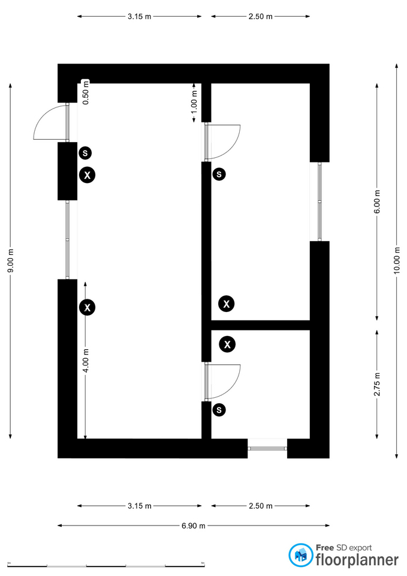

# Dokumentation – Integration von Lichtern und Buttons in das Smart-Home-Kartonmodell

## Projektübersicht

Im Rahmen dieses Projekts wurden bereits vorhandene und funktionsfähige Buttons sowie LEDs in ein bestehendes Smart-Home-Kartonmodell integriert. Ziel war es, die Komponenten sauber im Modell zu verbauen und die Bedienung sowie Visualisierung innerhalb des Smart Homes umzusetzen.

Das Kartonmodell selbst wurde bereits zuvor gebaut. In dieser Umsetzung lag der Fokus ausschließlich auf der Integration der Elektronik.

---

# Verwendete Komponenten

## Buttons

Es wurden insgesamt 4 Buttons eingebaut.

Die Buttons dienen zur Steuerung verschiedener Funktionen innerhalb des Smart Homes.

### Funktionen der Buttons

- Ein-/Ausschalten von LEDs
- Simulation von Smart-Home-Eingaben
- Steuerung einzelner Bereiche

---

## LEDs

Es wurden insgesamt 3 LEDs integriert.

Die LEDs dienen zur Darstellung verschiedener Zustände innerhalb des Smart Homes.

### Funktionen der LEDs

- Lichtsimulation
- Statusanzeige
- Darstellung aktiver Funktionen

---

# Verkabelung

## Verlängerte Kabel

Da die ursprünglichen Kabel für die Positionierung innerhalb des Kartonmodells zu kurz waren, wurden die Leitungen verlängert.

Die verlängerten Kabel ermöglichen:

- flexible Positionierung der Komponenten
- saubere Kabelführung
- bessere Integration in das Smart Home
- einfachere Montage

Die Kabel wurden so verlegt, dass sie möglichst unauffällig innerhalb des Modells verlaufen.

---

# Einbau der Buttons

Die 4 Buttons wurden an verschiedenen Stellen des Kartonmodells befestigt.

Beim Einbau wurde darauf geachtet, dass:

- die Buttons von außen erreichbar sind
- die Bedienung einfach möglich ist
- die Befestigung stabil ist
- die Kabel sicher verlegt werden

Die Buttons wurden mit Aussparungen im Karton befestigt und anschließend mit den verlängerten Kabeln verbunden.

---

# Einbau der LEDs

Die 3 LEDs wurden in das Smart Home integriert, um verschiedene Räume oder Funktionen sichtbar darzustellen.

Beim Einbau wurde darauf geachtet, dass:

- die LEDs gut sichtbar sind
- die Lichtwirkung im Modell erkennbar ist
- die Verkabelung sauber verläuft
- die LEDs stabil befestigt sind

Die LEDs wurden durch kleine Öffnungen im Karton geführt und befestigt.

---

# Stromversorgung

Die Stromversorgung erfolgt über die bestehende Elektronik des Projekts.

Alle Buttons und LEDs sind mit dem zentralen System verbunden und funktionieren gemeinsam innerhalb des Smart Homes.

---

# Funktionsweise

## Ablauf

1. Ein Button wird gedrückt.
2. Das Signal wird an das System übertragen.
3. Die entsprechende Funktion wird verarbeitet.
4. Die zugehörige LED reagiert auf die Eingabe.
5. Der aktuelle Zustand wird sichtbar dargestellt.

---

# Herausforderungen

Während der Integration mussten folgende Punkte berücksichtigt werden:

- begrenzter Platz im Kartonmodell
- saubere Kabelführung
- stabile Befestigung der Komponenten
- Verlängerung der bestehenden Kabel
- Vermeidung von Kabelüberschneidungen

Diese Herausforderungen konnten erfolgreich umgesetzt werden.

---

# Ergebnis

Die vorhandenen Buttons und LEDs wurden erfolgreich in das Smart-Home-Kartonmodell integriert.

Durch die verlängerten Kabel konnten alle Komponenten flexibel positioniert werden. Das System funktioniert stabil und ermöglicht die Steuerung sowie Visualisierung verschiedener Smart-Home-Funktionen innerhalb des Modells.

---

# Zusammenfassung

Im Projekt wurden 4 Buttons und 3 LEDs in ein bestehendes Smart-Home-Kartonmodell eingebaut. Die Komponenten waren bereits funktionsfähig und wurden mithilfe verlängerter Kabel in das Modell integriert.

Das Ergebnis ist ein funktionierendes Smart Home mit sichtbarer Lichtsteuerung und bedienbaren Eingaben innerhalb des Kartonmodells.