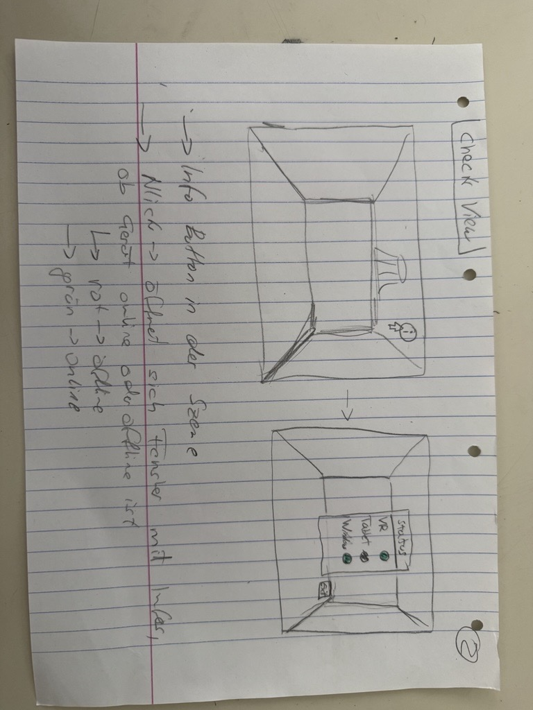

# CheckView – Inbetriebnahme View

## Skizze

---

## Akzeptanzkriterien

- [ ] Ein **Info-Button** im UI öffnet die CheckView
- [ ] Das CheckView-Panel zeigt folgende Verbindungsstatus an:
  - [ ] IP-Verbindung
  - [ ] Tablet-Verbindung
  - [ ] Window/Fenster-Verbindung
- [ ] Jeder Eintrag hat eine **Statusanzeige** (grün = verbunden, rot = nicht verbunden)
- [ ] Es wird geprüft, ob der **Gast online** ist
- [ ] Anzeige, welche **Clients** aktuell in der Session verbunden sind
- [ ] Während der Inbetriebnahme wird ein **PDF-Tutorial** eingeblendet
- [ ] Verschiedene Geräte werden mit **Icons** und ihrem Verbindungsstatus dargestellt
- [ ] Das Panel kann wieder **geschlossen** werden

---

## Abhängigkeiten

| Abhängigkeit | Beschreibung |
|---|---|
| OPC UA | Verbindungsstatus muss über OPC UA abfragbar sein |
| TextMeshPro | Wird für die Statusanzeigen im UI benötigt |
| View Switch | CheckView ist Teil des übergeordneten View-Switch-Systems |
