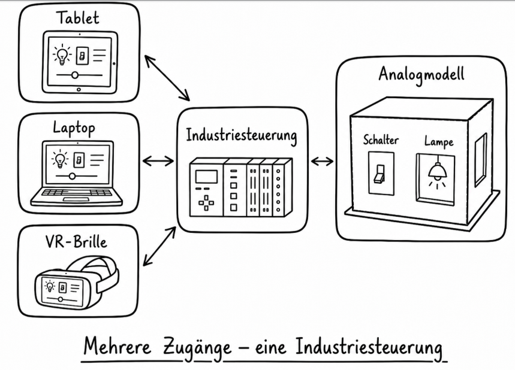
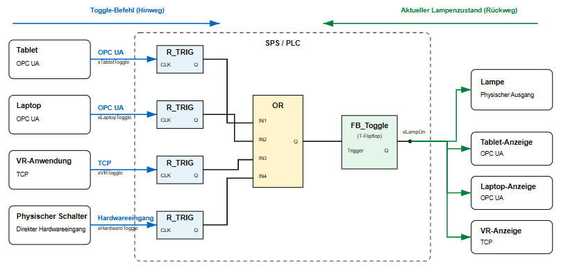

# Systemübersicht: Steuerungslogik der Eingänge – FBD-Darstellung

## Beschreibung

Das System dient zur Steuerung einer Lampe über mehrere unabhängige Eingangsquellen. Jeder Eingang kann einen Toggle-Befehl auslösen, wodurch der aktuelle Zustand der Lampe umgeschaltet wird.

Die Verarbeitung erfolgt zentral innerhalb der SPS (PLC). Dabei werden die Signale der verschiedenen Eingänge zusammengeführt, ausgewertet und anschließend an die Ausgänge weitergegeben.

Zusätzlich wird der aktuelle Lampenzustand an alle verbundenen Clients zurückgemeldet, sodass auf jeder Plattform jederzeit derselbe Zustand angezeigt wird.

---

## Komponenten

### 1. Eingangsquellen

**Übersichtsbild:**

*Datei: industrial/sandbox/Input_Diagramm_Ki.png*

Folgende Eingangsquellen sind im System vorhanden:

| Eingangsquelle      | Kommunikationsweg | Variable          |
| ------------------- | ----------------- | ----------------- |
| Tablet              | OPC UA            | `xTabletToggle`   |
| Laptop              | OPC UA            | `xLaptopToggle`   |
| VR-Anwendung        | TCP               | `xVRToggle`       |
| Physischer Schalter | Hardwareeingang   | `xHardwareToggle` |

Alle Eingänge senden einen Toggle-Befehl an die SPS.

Der blaue Pfeil im Diagramm stellt den Weg des Toggle-Befehls vom Client zur SPS dar.

---

### 2. Netzwerk / Kommunikation

Zur Übertragung der Signale werden unterschiedliche Kommunikationswege verwendet:

* **OPC UA**

  * Tablet → SPS
  * Laptop → SPS
  * SPS → Tablet-Anzeige
  * SPS → Laptop-Anzeige

* **TCP**

  * VR-Anwendung → SPS
  * SPS → VR-Anzeige

* **Hardwareeingang**

  * Physischer Schalter → SPS

Die SPS bildet die zentrale Steuerungseinheit und verarbeitet sämtliche Schaltanforderungen.

---

## Logik

Jeder Eingang wird zunächst über einen **R_TRIG-Baustein (Rising Edge Trigger)** verarbeitet.

Der R_TRIG erkennt eine steigende Flanke (0 → 1) und erzeugt daraus einen einmaligen Impuls. Dadurch wird verhindert, dass ein dauerhaft anliegendes Signal mehrfach ausgewertet wird.

Für jede Eingangsquelle wird ein eigener R_TRIG verwendet:

* R_TRIG für `xTabletToggle`
* R_TRIG für `xLaptopToggle`
* R_TRIG für `xVRToggle`
* R_TRIG für `xHardwareToggle`

Die Ausgänge aller vier R_TRIG-Bausteine werden anschließend auf eine zentrale OR-Verknüpfung geführt.

### OR-Verknüpfung

Die OR-Verknüpfung besitzt vier Eingänge:

* IN1 = Tablet
* IN2 = Laptop
* IN3 = VR-Anwendung
* IN4 = Physischer Schalter

Die Funktion der OR-Verknüpfung besteht darin, alle erzeugten Impulse zu einem gemeinsamen Signal zusammenzuführen.

Sobald mindestens ein Eingang einen Impuls liefert, wird der Ausgang der OR-Verknüpfung aktiv.

---

## FB_Toggle (T-Flipflop)

Der Ausgang der OR-Verknüpfung wird auf den Trigger-Eingang des Bausteins **FB_Toggle** geführt.

Der FB_Toggle arbeitet als T-Flipflop und übernimmt die eigentliche Schaltfunktion.

### Funktion

Bei jedem Triggerimpuls wird der gespeicherte Ausgangszustand umgeschaltet:

| Aktueller Zustand | Neuer Zustand |
| ----------------- | ------------- |
| 0                 | 1             |
| 1                 | 0             |

Der Zustand bleibt gespeichert, bis ein neuer Triggerimpuls eintrifft.

Der Ausgang des FB_Toggle ist die Variable:

`xLampOn`

Diese Variable repräsentiert den aktuellen Zustand der Lampe.

---

## Ausgangsverarbeitung

Die Variable `xLampOn` wird gleichzeitig an mehrere Ausgänge verteilt.

### Physischer Ausgang

* Lampe

### OPC-UA-Ausgänge

* Tablet-Anzeige
* Laptop-Anzeige

### TCP-Ausgang

* VR-Anzeige

Alle Ausgänge erhalten denselben Zustandswert.

Dadurch wird sichergestellt, dass sämtliche Geräte denselben Lampenzustand anzeigen.

---

## Rückmeldung des Lampenzustands

Neben dem Toggle-Befehl existiert ein Rückkanal für den aktuellen Lampenzustand.

Der grüne Pfeil im Diagramm kennzeichnet diesen Kommunikationsweg.

Über diesen Rückweg wird die Variable `xLampOn` an folgende Komponenten übertragen:

* Lampe
* Tablet-Anzeige
* Laptop-Anzeige
* VR-Anzeige

Dadurch wird eine durchgängige Synchronisation aller Plattformen gewährleistet.

---

## Ausgang

Der Ausgang der SPS wird durch die Variable `xLampOn` repräsentiert.

Jeder gültige Triggerimpuls eines Eingangs bewirkt:

1. Erkennung der steigenden Flanke durch einen R_TRIG
2. Weitergabe des Impulses an die OR-Verknüpfung
3. Aktivierung des FB_Toggle
4. Umschalten von `xLampOn`
5. Aktualisierung der Lampe
6. Rückmeldung des neuen Zustands an alle Clients

Das T-Flipflop steuert anschließend die eigentlichen Smart-Home-Aktoren, z. B. Lampen.

---

## Zusammenfassung

* Vier unabhängige Eingangsquellen
* Kommunikation über OPC UA, TCP und Hardwareeingänge
* Flankenerkennung mittels R_TRIG
* Zusammenführung aller Eingangssignale über eine OR-Verknüpfung
* Umschaltung des Lampenzustands über einen FB_Toggle (T-Flipflop)
* Speicherung des Zustands in der Variablen `xLampOn`
* Ansteuerung einer physischen Lampe
* Rückmeldung des aktuellen Zustands an Tablet, Laptop und VR-Anwendung
* Synchronisation aller Plattformen über die SPS
* Trennung zwischen Toggle-Befehl (Hinweg) und Zustandsrückmeldung (Rückweg)
