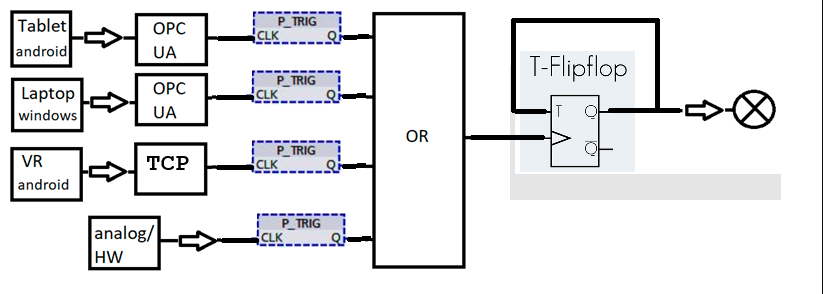

# Systemübersicht: Eingangslogik mit OPC UA und Hardware

## Beschreibung

Das System besteht aus mehreren Eingangsquellen, die über unterschiedliche Wege in eine zentrale Logik (**ODER-Verknüpfung**) geführt werden.  
Das Ergebnis steuert anschließend Aktoren im Smart Home (z. B. Lampen).

Folgende Eingangsquellen sind integriert:

- Physische Schalter (analog / Hardware)
- Tablet-Anwendung (Android)
- VR-Anwendung (Android)
- Laptop / Windows-Anwendung

Alle Eingaben werden über verschiedene Kommunikationswege (z. B. OPC UA, HTTP/WebRequests oder lokale Schnittstellen) an die zentrale Logik übermittelt.

Ein zentrales Ziel des Systems ist die **plattformübergreifende Synchronisation**:  
Wird ein Zustand über eine Plattform geändert, aktualisieren sich alle anderen Plattformen automatisch.  
Dadurch entsteht ein konsistentes Systemverhalten unabhängig vom Einstiegspunkt.

---

## Komponenten

### 1. Digitale Clients

**Übersichtsbild:**

*Datei: industrial/sandbox/Input_Diagramm_Ki.png*

Folgende Geräte senden ihre Signale an die zentrale Logik (Kommunikationsweg in Klammern):

- **Tablet (Android)** — HTTP / Web-Requests oder über ein OPC-UA-Gateway
- **Laptop (Windows)** — OPC UA Client
- **VR-Brille / VR-System (Android)** — HTTP / Web-Requests oder Middleware/Gateway

Hinweis: Ein nativer OPC UA Server auf Android-Geräten ist meist nicht praktikabel. Die Anbindung mobiler Geräte erfolgt daher über HTTP/Web-Requests, Middleware oder über Gateways.

Alle Clients greifen auf dieselbe zentrale Logik zu; die Kommunikation erfolgt plattformübergreifend.

---

### 2. Netzwerk / Kommunikation

- OPC UA für industrielle / strukturierte Kommunikation  
- HTTP/WebRequests für mobile Anwendungen  
- LAN-Verbindungen zwischen:
  - Zentraler Logik (z. B. SPS/Server)
  - OPC UA Clients
  - Optionalen Gateways

**Optionale Gateways:**

Optionale Gateways sind Vermittler/Protokollübersetzer zwischen mobilen Geräten und der Industrie-Steuerung. Beispiele:

- Ein OPC-UA-Gateway, das HTTP-Requests von Android-Clients in OPC UA-Variablen überführt
- Ein MQTT-Broker oder eine Middleware, die Signale normalisiert und weiterleitet
- Hardware-Protokollwandler für proprietäre Schnittstellen

In unserem Projekt dienen Gateways vor allem dazu, mobile Plattformen (Tablet, VR) und die zentrale Steuerung zuverlässig zu koppeln.

---

## Logik

Jeder Eingang wird zunächst als kurzer Impuls verarbeitet. Dazu wird ein sogenannter **Puls-Trigger (P_TRIG)** verwendet, der auf steigende Zustände reagiert und einen einmaligen Impuls erzeugt.

Diese Impulse werden anschließend in einer zentralen **ODER-Verknüpfung (OR)** zusammengeführt.

- Wenn **mindestens ein Eingang einen Impuls erzeugt**, liefert die OR-Stufe einen aktiven Impuls  
- Wenn **kein Eingang einen Impuls erzeugt**, bleibt die OR-Stufe inaktiv  

Dieser kombinierte Impuls wird nicht direkt als Schaltbefehl genutzt. Stattdessen dient er als Takt für ein **T-Flipflop**.

- Jeder aktive Eingang führt zu einem Impuls an der OR-Stufe  
- Jeder OR-Impuls toggelt den Zustand des T-Flipflops  
- Das Flipflop speichert den aktuellen Ausgangszustand bis zum nächsten Impuls  

### Zustandsübersicht

Direkte Eingänge / Plattformen

| Windows (Laptop) | VR (Brille) | Tablet | Analoge Eingänge | Ausgang |
|------------------|-------------|--------|------------------|---------|
| 0                | 0           | 0      | 0                | 0       |
| 1                | 0           | 0      | 0                | 1       |
| 0                | 1           | 0      | 0                | 1       |
| 0                | 0           | 1      | 0                | 1       |
| 0                | 0           | 0      | 1                | 1       |
| 1                | 1           | 0      | 0                | 1       |
| 1                | 0           | 1      | 0                | 1       |
| 1                | 0           | 0      | 1                | 1       |
| 0                | 1           | 1      | 0                | 1       |
| 0                | 1           | 0      | 1                | 1       |
| 0                | 0           | 1      | 1                | 1       |
| 1                | 1           | 1      | 0                | 1       |
| 1                | 1           | 0      | 1                | 1       |
| 1                | 0           | 1      | 1                | 1       |
| 0                | 1           | 1      | 1                | 1       |
| 1                | 1           | 1      | 1                | 1       |

---

## Ausgang

Der OR-Ausgang wird nicht direkt als Schaltbefehl an die Aktoren weitergegeben. Stattdessen wird er als Takt für ein **T-Flipflop** genutzt:

- Jeder Eingang erzeugt einen Impuls über einen P_TRIG  
- Die Impulse werden im OR zusammengeführt  
- Jeder OR-Impuls toggelt das T-Flipflop  
- Das Flipflop hält den Ausgangszustand bis zum nächsten Impuls  

Dadurch wechselt der Ausgangszustand bei jedem aktiven Eingangssignal. Diese Logik eignet sich besonders, wenn der Schaltvorgang nicht als reines "EIN/AUS direkt vom Eingang", sondern als **Umschalten bei jeder Eingabe** gedacht ist.

Das T-Flipflop steuert anschließend die eigentlichen Smart-Home-Aktoren, z. B. Lampen.

---

## Zusammenfassung

- Mehrere Eingangsquellen (Software + Hardware)
- Zentrale Verarbeitung über OR-Logik
- OPC UA für strukturierte Kommunikation (v. a. Windows / industrielle Systeme)
- Alternative Schnittstellen für mobile Geräte
- Direkte Hardwareanbindung für physische Eingänge
- Synchronisation aller Systeme für konsistentes Verhalten

