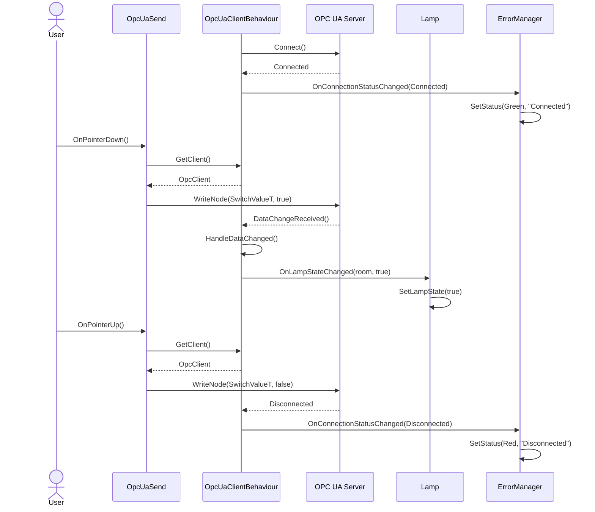

```mermaid

sequenceDiagram

actor User

participant Send as OpcUaSend
participant Client as OpcUaClientBehaviour
participant Server as OPC UA Server
participant Lamp
participant Error as ErrorManager

%% Verbindungsaufbau
Client->>Server: Connect()
Server-->>Client: Connected

Client->>Error: OnConnectionStatusChanged(Connected)
Error->>Error: SetStatus(Green, "Connected")

%% Button gedrückt
User->>Send: OnPointerDown()

Send->>Client: GetClient()
Client-->>Send: OpcClient

Send->>Server: WriteNode(SwitchValueT, true)

Server-->>Client: DataChangeReceived()

Client->>Client: HandleDataChanged()

Client->>Lamp: OnLampStateChanged(room, true)

Lamp->>Lamp: SetLampState(true)

%% Button losgelassen
User->>Send: OnPointerUp()

Send->>Client: GetClient()
Client-->>Send: OpcClient

Send->>Server: WriteNode(SwitchValueT, false)

%% Disconnect
Server-->>Client: Disconnected

Client->>Error: OnConnectionStatusChanged(Disconnected)

Error->>Error: SetStatus(Red, "Disconnected")
```